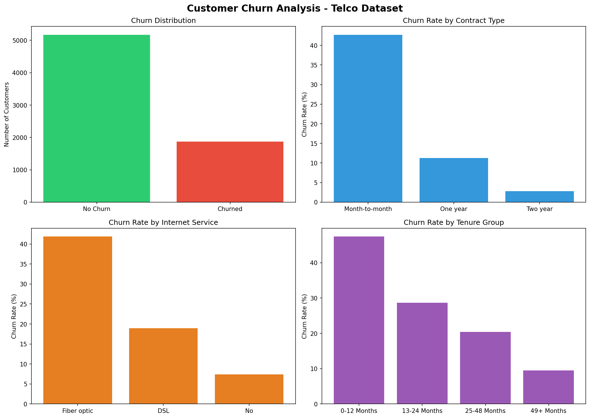

# 📊 Customer Churn Analysis — Telco Dataset

## Project Overview
This project analyzes customer churn patterns for a telecommunications company using Python and MySQL. The goal is to identify key factors driving customer churn and provide actionable business insights.

## 🛠️ Tools & Technologies
| Tool | Purpose |
|------|---------|
| Python | Core programming language |
| Pandas & NumPy | Data manipulation & cleaning |
| Matplotlib & Seaborn | Data visualization |
| MySQL | Database storage & SQL queries |
| SQLAlchemy | Python-MySQL connection |
| Jupyter Notebook | Development environment |

## 📁 Dataset
- **Source:** Kaggle — Telco Customer Churn Dataset
- **Size:** 7,043 rows × 21 columns
- **Features:** Customer demographics, services, contract type, charges, churn status

## 🔍 Project Workflow
1. **Data Loading** — Imported CSV dataset into Pandas DataFrame
2. **Data Exploration** — Analyzed shape, dtypes, missing values
3. **Data Cleaning** — Converted TotalCharges to numeric, encoded Churn column
4. **MySQL Integration** — Loaded data into MySQL via Table Data Import Wizard
5. **SQL Analysis** — Ran business queries to uncover churn patterns
6. **Visualization** — Created 4-panel dashboard using Matplotlib

## 📈 Key Findings
- ✅ Overall churn rate: **26%**
- ✅ Month-to-month contracts: **42.71%** churn rate (highest risk)
- ✅ Fiber optic customers: **41.89%** churn rate
- ✅ New customers (0-12 months): **47.44%** churn rate
- ✅ Long-term customers (49+ months): only **9.51%** churn rate

## 📊 Dashboard Preview

## 💡 Business Recommendations
- Focus retention efforts on **month-to-month** contract customers
- Investigate **fiber optic** service quality issues
- Create **loyalty programs** for customers in first 12 months
- Offer **long-term contract incentives** to reduce churn

## 👤 Author
**Zahid Ahmad** — Junior Data Analyst
- GitHub: [ZahidZaiin1122](https://github.com/ZahidZaiin1122)
- Tableau: [Zahid Ahmad](https://public.tableau.com/app/profile/zahid.ahmad1692)
- LinkedIn: [Zahid Ahmad](https://www.linkedin.com/in/zahid-ahmad-88ba92216)
- 
